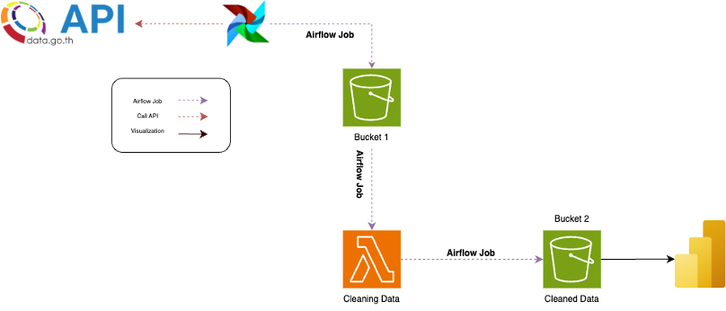

# Data Warehouse and Business Intelligence Capstone Project

#### Read Full Document: https://drive.google.com/file/d/1calACfJJnvzar0j637Qcp0WlN1clrBte/view?usp=drive_link

#### Slide Presentation: https://drive.google.com/file/d/1Qc6vJgT5SHZG4Tfd3UxSVIfJZGGAtauY/view?usp=drive_link

## Authors:
- Saranporn Kanjanasukhon 65199160202
- Atcharawan Kamsai 65199160206

## Table of Contents
1. [Introduction](#introduction)
2. [Technologies Used](#technologies-used)
3. [Project Details](#project-details)
    - [Diagram Data Pipeline](#diagram-data-pipeline)
    - [Workflow Description](#workflow-description)
    - [Problem Statement](#problem-statement)
    - [Data Modeling](#data-modeling)
    - [Cloud Platform](#cloud-platform)
    - [Data Ingestion and Orchestration](#data-ingestion-and-orchestration)
    - [Data Warehouse](#data-warehouse)
    - [Data Transformation](#data-transformation)
    - [Dashboard](#dashboard)

## Introduction
In this project, we aim to gather income data from the Thailand government's open data portal using their provided API. The collected data will be stored, processed, and visualized to provide insights into government revenue and expenditure.

## Technologies Used
1. GitHub Codespaces
2. Docker
3. Airflow
4. AWS S3
5. AWS Lambda
6. Power BI

## Project Details

### Diagram Data Pipeline

### Workflow Description:
#### Data Scraping and Storage:
- Python code will scrape data from the provided API.
- Airflow will periodically run the scraping job and store data in an AWS S3 bucket.

#### Data Cleaning and Storage:
- A second Airflow job will trigger a Lambda function upon data arrival in the S3 bucket.
- The Lambda function will execute data cleaning tasks and save processed data to another S3 bucket.

#### Data Visualization:
- Python scripts will connect cleaned data in S3 with Power BI for creating interactive visualizations.

### Problem Statement
The government needs a summary of annual revenue collection to implement targeted revenue policies effectively. Citizens also need access to revenue summaries to assess the government's performance.

### Data Modeling
#### 1) Revenue Table:
- Stores revenue data with columns like id, government agency, month, value, etc.
#### 2) Date Table:
- Separate dimension table with fields for Date, Month, and Year.
#### 3) Expenses Table:
- Stores expense data with columns similar to the revenue table.

### Cloud Platform
- **Amazon Web Services (AWS)**
    - **Amazon S3**: Used for collecting and storing raw and cleaned data.
    - **AWS Lambda**: Used for data transformation.

### Data Ingestion and Orchestration:
- **Workflow Orchestration with Airflow**: Manages the end-to-end data pipeline effectively.

### Data Warehouse
- Dataset partitioned into two separate storage locations for improved manageability and query performance.

### Data Transformation
- AWS Lambda is used to transform the data into a format suitable for creating a dashboard.

### Dashboard
- Power BI is utilized to create interactive visualizations based on the collected and cleaned data.

Power BI Dashboard: https://app.powerbi.com/view?r=eyJrIjoiYTk1MWJlYTAtNTg4MC00OWE3LWJhNWQtZmM3Y2MyYzRjNTI1IiwidCI6ImY5MGM0NjQ3LTg4NmYtNGI0Yy1iMmViLTU1NWRmOWVjNGU4MSIsImMiOjEwfQ%3D%3D 
